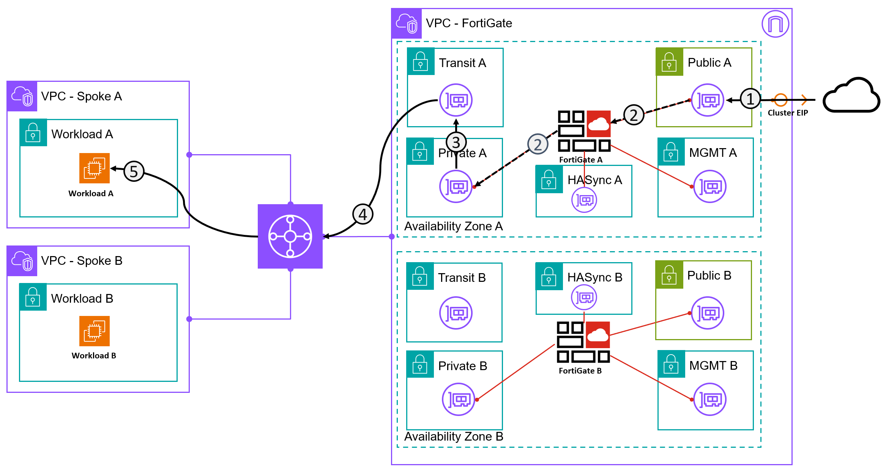

---
hide:
  - toc
---
# Exercise 2 - Ingress (No SNAT)

### Ingress Traffic flow from Jumpbox to WorkloadA (no SNAT)

**This is an extension of Exercise 1**

!!! Info
    The IP Address of the Ubuntu Host is 10.99.98.10

!!! Success "Success Requirement"
    1. From your device (not the Jumphost) SSH to Workload A using `ssh -P <port> -i sshkey-aplab-ssh-priv.pem ubuntu@<clusterIP>` Use the port forward you configured
    3. Run `ss -nat` on Workload A and confirm the source IP is the FortiGate. Look for ESTAB sessions

!!! Warning
    Either use port translation or change the FortiGate SSH listening listening address on Port1. **Port translation is preferred**

!!! Danger
    Multiple failed login attempts to the FortiGate SSH CLI will result in a 5+ minute lockout. AAny failed login should be carefully considered before attempting again. Ask yourself - Am I connecting to the FortiGate or to the Ubuntu host?

!!! Tip
    FortiGate offers powerful diagnostic tools. Try some of the following when connecting  
    `diag sniffer packet any ‘tcp and port 22’ 4 0 1`   
    `diag sniffer packet any ‘tcp and port 2222’ 4 0 1` - if using a tcp port translation  
    `diag sniffer packet any ‘host <ip>’ 4 0 1` - if you want to focus on a specific IP

??? Failure "Help I'm Lost!"
    1. Just policy?
