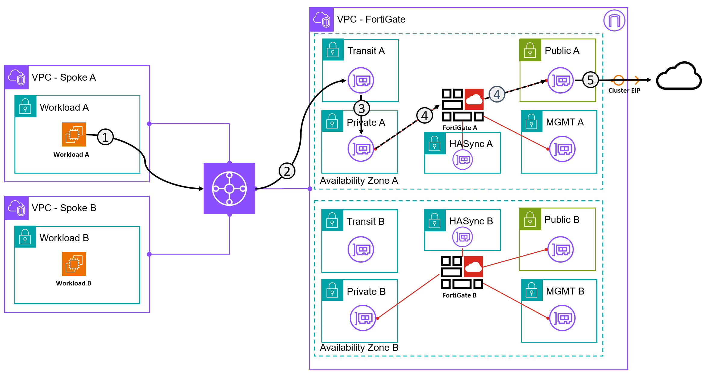

---
hide:
  - toc
---
# Exercise 3 - Egress

### Egress traffic to the Internet from the Spoke VPCs

!!! Success "Success Requirement"
    1. From Workload A - ping/curl/wget public services.
    2. `ping 8.8.8.8` or `ping 1.1.1.1`
    3. `curl ipinfo.io` what IP do you see? You can also use `ssh sshmyip.com` 
    4. `ss -nat` on Workload A and confirm the source is the original source IP.

!!! Tip
    FortiGate offers powerful diagnostic tools. Try some of the following when connecting  
    `diag sniffer packet any ‘icmp’ 4 0 1`   
    `diag sniffer packet any ‘tcp and port 443’ 4 0 1`   
    `diag sniffer packet any ‘host 1.1.1.1’ 4 0 1` - if you want to focus on a specific destination for a ping for example

??? Failure "Help I'm Lost!"
    1. Create a Policy? From where to where?
