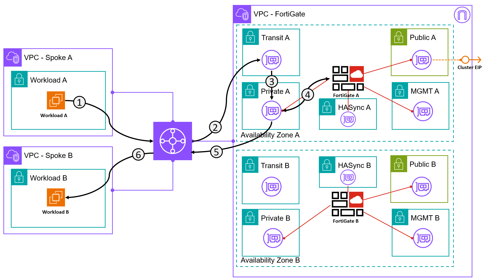

---
hide:
  - toc
---
# Exercise 4 - East-West

### Egress traffic to the Internet from the Spoke VPCs

!!! Info "IP Address Quick Reference"
    - The IP Address of the Workload A is 10.99.98.10
    - The IP Address of the Workload B is 10.99.97.10

!!! Success "Success Requirement"
    1. From Workload A - Successfully ping Workload B
    2. From Workload A - Successfully SSH to Workload B 

!!! Info
    SSH in AWS Requires SSH keys unless you do additional bootstrap activities to override this. SSH-Agent has not been enabled on Workload A and Workload B. To accommodate SSH from Workload A to Workload B you will need to get the key from the Jumphost to Workload A. While on the Jumphost:
    ```sh
    scp -i sshkey-aplab-ssh-priv.pem sshkey-aplab-ssh-priv.pem ubuntu@<FGT Cluster IP>:.
    ```
    If using a custom port (as you should)
    ```sh
    scp -P <custom port> -i sshkey-aplab-ssh-priv.pem sshkey-aplab-ssh-priv.pem ubuntu@<FGT Cluster IP>:.
    ```
    This will copy the SSH key to the home directory of Workload A and you can initiate the session from there.

    **Note the . after the : - This is eseential. Don't forget the .**



!!! Tip
    FortiGate offers powerful diagnostic tools. Try some of the following when connecting  
    `diag sniffer packet any ‘icmp’ 4 0 1`   
    `diag sniffer packet port2 ‘tcp and port 2’ 4 0 1`   
    `diag sniffer packet any ‘host 10.99.98.10’ 4 0 1` - one of the spokes

??? Failure "Help I'm Lost!"
    1. Create a Policy?
    2. Make sure you use the key you copied to Workload A when you connect to Workload B
