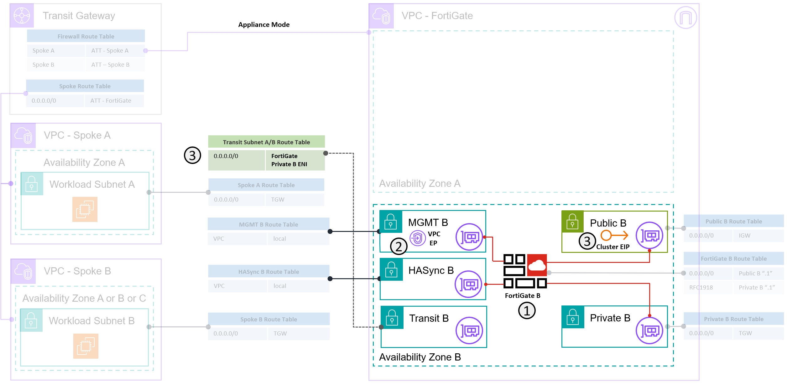

---
hide:
  - toc
---
# Exercise 5 - High Availability

### Egress traffic to the Internet from the Spoke VPCs

!!! Success "Success Requirement"
    1. Confirm connectivity established in Exercise 1-4
    2. Monitor the failover mechanism
    3. See how our sessions behave during a failover.



To fully test HA we need to have multiple active sessions open when we begin the HA event. Specifically an ingress flow and an east-west flow. Ideally with a protocol that doesn't handle resumption and a protocol that is not session based. We ill be using:

 - SSH for TCP non session aware protocol
 - Ping for the non-session based protocol

 To achieve this we are going to use a [Byobu](https://www.byobu.org/) a tmux/screen implementation available on Ubuntu that allows us to detach our session and resume the session later. This allows us to run things in the background while getting disconnected. 

- From the Jumphost connect to Workload A
- Run `byobu`
    - You will now be in a terminal session multiplexer
    - User ***control-a*** to initiate an action in byobu. This will pull up a menu asking what mode you want to use. Select 1 
    - ***control-a*** is a leader-key: You start the action with this then do the action with the next keypress. We wll be using ***control-a d*** to detach from a session once we have our flows running.
    - From the Byobu session on Workload A establish a SSH Session to Workload B
        - While on Workload B run a ping to Workload A
    - Now ***control-a d*** to detach from the Byobu session
- Everything is still running! The Byobu is still running you are just detached. As long as Workload A is still running you can always return to you Byobu session by running `byobu` again.
- Leave this SSH session open.

!!! Info
    In Byobu you can open a new terminal with ***control-a c*** and then ***control-a n***, ***control-a space*** and ***control-a p*** to cycle between the new terminals (tabs)

Now we are ready to initiate the failover and see what happens:
- Connect to FortiGate A and FortiGate B on their management IP addresses - either through the graphical administration terminal or by SSH connection directly to the FortiGates from your workstation as no SSH key is required (provided you have set a password during your first login)

!!! Warning  
    **Do not connect to the FortiGates from the Jumphost for these steps**


- On the Passive FortiGate
```
diag debug application awsd -1
diag debug enable
```

- On the Active FortiGate
```
exec ha failover set 1
```
Monitor the output

- Reconnect to Workload A and re-attach to the your Byobu session.

Feel free to repeat the failover if you want to run more tests.

HINT: If not your VIP is probably the problem … what is the solution though? “
show system vdom-exception?” What are these
Discussion – What sessions would survive a failover?


!!! Question "Questions: So what happened"
    1. What does the out on the Passive during the failover mean? Check AWS Console?
    2. What happened to you sessions and why? 
    3. Which sessions survived?
    4. How many ping packets did you lose?
    5. What if it didn't work? (see the failure information below)

!!! Failure "FAIL "I cant reconnect to  Workload A""
    1. The EIP and Routes moved but still can't connect.
        - What is wrong with your VIP?
        - **Discussion** - `config system vdom-exception` 
    2. The EIP and Routes didn't move!
        - Phone a friend - call the instructor.

!!! Tip "Tip "My SSH has locked my session"
    If an SSH terminal is hanging due to a disconnection you can break out of this by using the following sequence: *enter - enter - ~ - .*
    ***enter***
    ***enter*** - a 2nd enter just to make sure
    ***~*** - Tilde key
    ***.*** - Period
   
